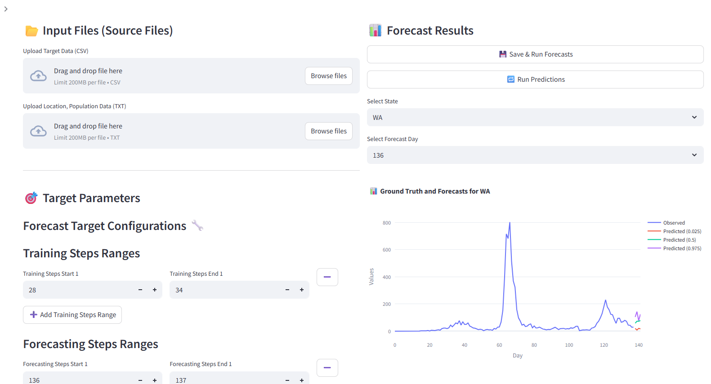

# LEMMA: A Lightweight Epidemic Modeling and Analytics tool for Forecasting

LEMMA is designed to streamline and automate the process of generating quick time-series forecasts for infectious diseases. This codebase provides tools and utilities for data preprocessing, model training, and forecast generation. By default, it generates some intermediate forecasts, learns from their mistakes, and then generates the final forecasts.
To get access to the web interface for producing forecasts, please contact ajiteshs@usc.edu.

## Web Interface



The LEMMA web interface allows users to interact with the forecasting models easily. Users can upload their datasets, set forecast targets, select models, and visualize the generated forecasts.
The web interface is designed to be user-friendly and intuitive, making it accessible to users with varying levels of technical expertise.

### Features
- **Upload Input Files**:
    In the 📂 Input Files (Source Files) section:
    - Upload the Target Data (CSV) file for the target data (cases/ hospitalizations/ deaths). The file must be a matrix of numbers (no headers) with each row indicating the time-series for one location.
    - Upload the Location Data (CSV) file for location names and populations. This must be a csv file containing two headers:
    *location_name*: Location names corresponding to each row in the Target Data file
    *population*: Population of the corresponding location

	**Tip**: Along with loading local files, you can also directly load from a URL by pasting it in the open dialog box.

- **Set Forecast Target Configurations**:
In the 🎯 Target Parameters section: <br>
	- **Training steps**: Time-steps on which LEMMA should run the "intermediate" forecasting models and learn from their mistakes. 
	- **Forecasting steps**: Time-steps at which forecasts are desired. For prospective forecast, the forecastign step will be the last time step.
	- **weeks ahead (bins ahead)**: Number of bins (e.g., weeks) in the forecast horizon.
	- **bin size**: Number of time-steps in one bin. For instance, the input file may have a daily time-series, but we may want forecast at weekly level. Then ```bin size = 7```.
 
- **Select Forecasting Models**:
    The User can open the Sidebar and select the desired "intermediate" forecasting model from the list of available models.    The app will display the selected model's hyperparameters and allow the user to adjust them as needed.  For now, only the [SIkJalpha model](https://www.sciencedirect.com/science/article/pii/S1755436523000658) is provided.
    
- **Generate Forecasts**:
    In the 📊 Forecast Results section: <br>
    - Click the "💾 Save & Run Forecasts" button to to save the updated configuration and generate forecasts. (Known bug: Sometimes, an error is displayed which goes away on second click)
    - A progress bar will display the status of the forecast generation. 
    
- **View and Analyze Results**:
    - Select a State from the dropdown to view its data.
    - Use the Select Forecast Day dropdown to choose a specific forecast day.
    - The app will display a chart showing:
        - Observed data.
        - Predicted data with quantiles.
- **Re-run Predictions**:
    - If you change the desired quantiles, click the "Re-run Predictions" button to re-run the predictions with the updated configuration.
    - The app will display a success message once the predictions are completed.


## Running the Interface on Your Machine
1. Install the required dependencies:
   ```bash
   pip install -r requirements.txt
   ```
2. Run the Streamlit app:
   ```bash
    streamlit run app.py
    ```
3. Streamlit will generate URLs on which the interface is served.


    
## How to Add New Models (beta)
To add new models to the LEMMA project, follow these steps:
1. **Place your new model.py file in the input_models Folder**
2. **Define the Model's Parameters** <br> Inside the new model file, define the required parameters and functions
3. **Update model_config.py**
Open the *model_config.py* file in the input_models folder.
Add your new model to the estimation_models or simulation_models dictionary and define its parameters.
4. **Integrate the Model in the Streamlit App**
Open the app.py file.
Ensure the new model appears in the dropdowns for Estimation Model and Simulation Model:    
```python
est_model = st.sidebar.selectbox("Estimation Model", list(model_config.estimation_models.keys()))
sim_model = st.sidebar.selectbox("Simulation Model", list(model_config.simulation_models.keys()))
```
5. **Replace the function call in *process_scenario.py***
6. **Test the Model** <br> Run the Streamlit app and test 
```python
streamlit run app.py
```

## Files
- **app.py**: The main entry point for the Streamlit web application. It handles user interactions, file uploads, and model selection.
- **model_config.py**: Contains the configuration for different forecasting models, including their parameters and settings.
- **config_param.py**: Serves as the configuration hub for the codebase. It defines key parameters, constants, and data inputs required throughout the forecasting pipeline. These configurations are used by various modules to ensure consistency and flexibility in the forecasting process.
- **gen_predictions.py**: This file is responsible for generating predictors that will produce the "intermediate" forecasts. 
- 
- **predictors.py**: The file generates time-series predictors for different retroactive lookback periods and scenarios, which are essential inputs for training forecasting models. It leverages parallel processing to improve performance and handles large-scale scenario simulations efficiently.

- **process_scenario.py**: The file processes individual scenarios by genertaitng forecasts based on parameterized models. It is the core component of the forecasting pipeline, enabling the generation of scenario-specific predictions for use in broader analyses.

- **utils.py**: The utils.py file provides essential preprocessing functions to aggregate data, prepare regression inputs, and clean datasets for model training. These utilities streamline the data pipeline for forecasting models in the LEMMA project.
Functions Summaries: 
    - **bin_array**: Aggregates data into bins along a specified axis.
    - **regression_prep**: Prepares training data for regression models by converting target data into a numpy array, processes predictors for each lookback scenario, bins predictors and target data, normalizes them by the population and applies decay factors. Collects training features (X_train), targets (Y_train), weights (W_train), and metadata (ID).
    - **prepare_data_for_model**: Prepares data for model training by combining old and new datasets by extracting  relevant columns. Combines them into a single dataset and removes rows with missing values.
    Separates and returns features (X_clean), targets (y_clean), and weights (weights_clean).
    
