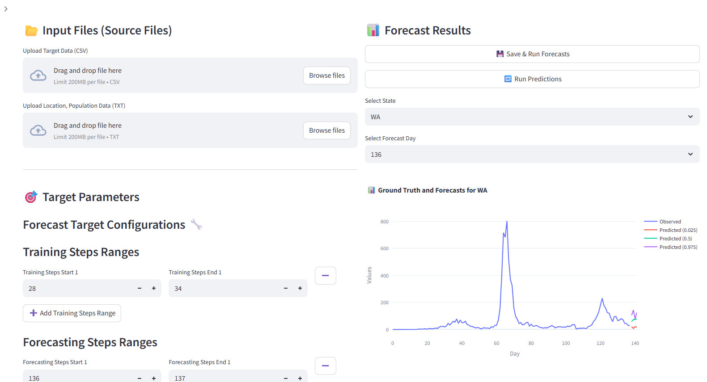

# LEMMA: A Lightweight Epidemic Modeling and Analytics tool for Forecasting


LEMMA is a lightweight, user-friendly tool for generating time-series forecasts for infectious diseases. It supports both a web interface and a command-line interface (CLI), with robust, data-driven defaults for all key settings. LEMMA outputs forecasts in the Hubverse quantile format and is designed for ease of use, flexibility, and reproducibility.

**Key Features:**
- Dynamic, data-driven defaults for training and forecast windows (no manual tuning required)
- User-facing configuration in terms of dates and bins (not internal indices)
- ARIMA is the default model (with other models available)
- Hubverse-compatible quantile output format
- Robust handling of missing data and edge cases
- Streamlit web UI and CLI support

To get access to the web interface for producing forecasts, please contact ajiteshs@usc.edu.

## Web Interface



The LEMMA web interface allows users to interact with the forecasting models easily. Users can upload their datasets, set forecast targets, select models, and visualize the generated forecasts.
The web interface is designed to be user-friendly and intuitive, making it accessible to users with varying levels of technical expertise.

### Features
- **Upload Input Files**:
    In the 📂 Input Files (Source Files) section:
    - Upload the Target Data (CSV) file for the target data (cases/ hospitalizations/ deaths). The file must be a matrix of numbers (no headers) with each row indicating the time-series for one location.
        - Or upload a Hubverse observed target-data CSV (must include `location`, `target_end_date`, and at least one of `weekly_rate` or `observation`).
            - If the file includes `target`, set `hubverse_target` to select one target.
            - If `target` exists and `hubverse_target` is not set, each `(location, target)` pair is treated as a separate location row internally.
            - If `weekly_rate` is present, it is preferred over `observation`.
            - If population metadata is unavailable, LEMMA uses a dummy shared population value of `100 * max(observed_value)`.
            - You may optionally upload a location/population file in Hubverse mode; if provided, it is used for population mapping.
    - Upload the Location Data (CSV) file for location names and populations. This must be a csv file containing two headers:
    *location_name*: Location names corresponding to each row in the Target Data file
    *population*: Population of the corresponding location

	**Tip**: Along with loading local files, you can also directly load from a URL by pasting it in the open dialog box.

- **Set Forecast Target Configurations**:
In the 🎯 Target Parameters section: <br>
    - **Training window**: Select the start and end dates for model training. If left blank, LEMMA will automatically choose a robust default window based on your data and forecast horizon.
    - **Forecast window**: Select the start and end dates for forecast generation. If left blank, LEMMA will use the last available data date as the last possible forecast origin.
    - **Weeks ahead (bins ahead)**: Number of bins (e.g., weeks) in the forecast horizon.
    - **Bin size**: Number of time-steps in one bin. For example, if your data is daily but you want weekly forecasts, set `bin size = 7`.
 
- **Select Forecasting Models**:
    The User can open the Sidebar and select the desired forecasting model. By default, Flatline is selected, but other models (such as ARIMA and SIkJalpha) are available. The app will display the selected model's hyperparameters and allow the user to adjust them as needed.
    
- **Generate Forecasts**:
    In the 📊 Forecast Results section: <br>
    - Click the "💾 Save & Run Forecasts" button to save the updated configuration and generate forecasts.
    - A progress bar will display the status of the forecast generation. 
    
- **View and Analyze Results**:
    - Select a State from the dropdown to view its data.
    - Use the Select Forecast Day dropdown to choose a specific forecast day.
    - The app will display a chart showing:
        - Observed data.
        - Predicted data with quantiles.
    - Use the **Download All Forecasts (CSV)** button to export all generated forecasts in Hubverse quantile format.
- **Re-run Predictions**:
    - If you change the desired quantiles, click the "Re-run Predictions" button to re-run the predictions with the updated configuration.
    - The app will display a success message once the predictions are completed.


## Running the Interface on Your Machine
1. Install the required dependencies:
   ```bash
   pip install -r requirements.txt
   ```
2. Run the Streamlit app:
   ```bash
   streamlit run app.py
   ```
3. Streamlit will generate URLs on which the interface is served.

## Running from Command Line (CLI)

You can generate forecasts without Streamlit and save all prediction results to a file. The CLI is config-driven and reads all settings from `user_config.py` and `config_param.py`.

1. Install dependencies:
    ```bash
    pip install -r requirements.txt
    ```
2. Run CLI forecasting:
    ```bash
    python main.py
    ```

**CLI forecast settings:**
- All forecast settings (including training/forecast windows, bins, and model selection) are controlled in `user_config.py`.
- If you leave the training or forecast window dates as `None`, LEMMA will automatically select robust, data-driven defaults based on your data and forecast horizon. This ensures the CLI works out-of-the-box for most datasets.
- Output location and format are set by `forecast_output_path` and `forecast_output_format` in `user_config.py`.

**Output format:**
Forecasts are saved in the Hubverse quantile format, with columns: `origin_date`, `horizon`, `location`, `output_type`, `output_type_id`, `value`.


## Configuration Guide

All user-facing configuration is in `user_config.py`.

**Primary settings to edit:**
- **Time/binning:** `timesteps_per_bin`, `bins_ahead`
- **Forecast model:** `predictor_approach` (default: Flatline), approach hyperparameters (e.g., `arima_autoregressive_orders`)
- **Target windows:** `training_window_start_date`, `training_window_end_date`, `forecast_window_start_date`, `forecast_window_end_date` (set to `None` for dynamic, data-driven defaults)
- **Quantiles:** `quantiles` (default: [0.0, 0.5, 1.0])
- **Ensemble:** `ensemble_method` (default: Random Forest)
- **Data paths:** `target_data_path`, `location_metadata_path`
- **Hubverse observed input (optional):** `hubverse_input_path` (or compatibility alias `hubvsereInput`), `hubverse_target`
- **CLI export:** `forecast_output_path`, `forecast_output_format`

**Derived/internal values (normally do not edit):**
- `retro_lookback`, `test_lookback` (auto-built from the train/test range settings unless explicit overrides are set)
- `npredictors`, `horizon`
- Processed arrays: `hosp_dat`, `hosp_cumu_s_org`, `popu`, `state_abbr`

**Validation helper:**
- `validate_config()` in `config_param.py` returns a list of detected config issues.

**Output columns (Hubverse quantile format):**
- `origin_date`: Forecast origin date (date of forecast)
- `horizon`: Forecast horizon bin (1..forecast_horizon_bins)
- `location`: Location identifier (location name)
- `output_type`: Always `quantile`
- `output_type_id`: Quantile level (e.g., 0.1, 0.5, 0.9)
- `value`: Predicted value


    

## How to Add New Models (beta)
To add new models to the LEMMA project, follow these steps:
1. **Place your new model.py file in the approaches/ folder**
2. **Define the Model's Parameters**: Inside the new model file, define the required parameters and functions
3. **Update config_param.py**: Register your new model in the model selection logic
4. **Integrate the Model in the Streamlit App**: Open app.py and ensure the new model appears in the dropdown for model selection
5. **Replace the function call in process_scenario.py** if needed
6. **Test the Model**: Run the Streamlit app and test
    ```bash
    streamlit run app.py
    ```

## Files
- **app.py**: The main entry point for the Streamlit web application. It handles user interactions, file uploads, and model selection.
- **model_config.py**: Contains the configuration for different forecasting models, including their parameters and settings.
- **config_param.py**: Serves as the configuration hub for the codebase. It defines key parameters, constants, and data inputs required throughout the forecasting pipeline. These configurations are used by various modules to ensure consistency and flexibility in the forecasting process.
- **gen_predictions.py**: This file is responsible for generating predictors that will produce the "intermediate" forecasts. 
- 
- **predictors.py**: The file generates time-series predictors for different retroactive lookback periods and scenarios, which are essential inputs for training forecasting models. It leverages parallel processing to improve performance and handles large-scale scenario simulations efficiently.

- **process_scenario.py**: The file processes individual scenarios by genertaitng forecasts based on parameterized models. It is the core component of the forecasting pipeline, enabling the generation of scenario-specific predictions for use in broader analyses.

- **utils.py**: The utils.py file provides essential preprocessing functions to aggregate data, prepare regression inputs, and clean datasets for model training. These utilities streamline the data pipeline for forecasting models in the LEMMA project.
Functions Summaries: 
    - **bin_array**: Aggregates data into bins along a specified axis.
    - **regression_prep**: Prepares training data for regression models by converting target data into a numpy array, processes predictors for each lookback scenario, bins predictors and target data, normalizes them by the population and applies decay factors. Collects training features (X_train), targets (Y_train), weights (W_train), and metadata (ID).
    - **prepare_data_for_model**: Prepares data for model training by combining old and new datasets by extracting  relevant columns. Combines them into a single dataset and removes rows with missing values.
    Separates and returns features (X_clean), targets (y_clean), and weights (weights_clean).
    
